# ComfyUI TK3R Extensions
Extended versions of various ComfyUI nodes plus some utility nodes.

## Description
This repository contains custom nodes for ComfyUI that provide extended capabilities beyond the standard nodes as well as some utility nodes.


## Installation

### Method 1: ComfyUI Manager (Recommended)

1. Install [ComfyUI Manager](https://github.com/ltdrdata/ComfyUI-Manager)
2. Search for "TK3R Extensions" in the manager
3. Click Install

### Method 2: Manual Installation

1. Navigate to your ComfyUI custom nodes directory:
   ```bash
   cd ComfyUI/custom_nodes
   ```

2. Clone this repository:
   ```bash
   git clone https://github.com/TK3R/ComfyUI_TK3R_Ext.git
   ```

3. Restart ComfyUI


## Usage
After installation, the nodes will appear in ComfyUI under the "TK3R Advanced" and "TK3R Utility" categories. Each node provides specific functionality:


### TK3R ControlNet Apply Advanced
Advanced version of the ControlNet Apply node with a strength decay option. Allows gradual decay of the controlnet strength rather than sharp cutoff. Similar principle as the Qwen/ZImage controlnet nodes, see examples below.


### TK3R Qwen Image Diffsynth ControlNet Advanced / TK3R ZImage Fun Controlnet
Advanced version of the QwenImageDiffsynthControlnet / ZImageFunControlnet nodes with start / stop control as well as strength decay option, allowing significantly more control and making controlnets more useful. For example cutting off the controlnet influence earlier frees the model to fill in finer details, or you can cut off very early so that the controlnet only guides the general composition.

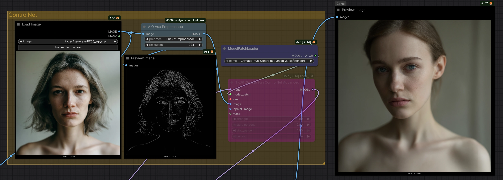

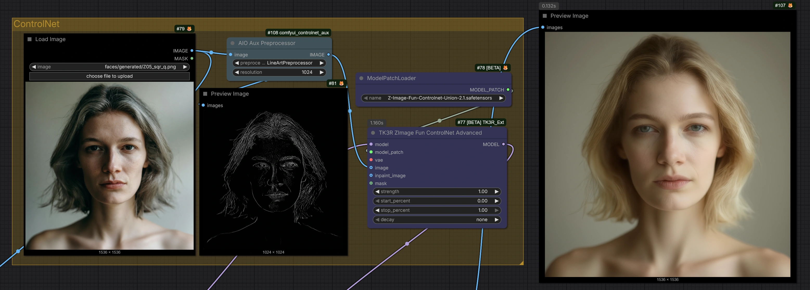

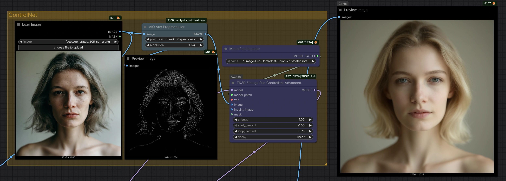

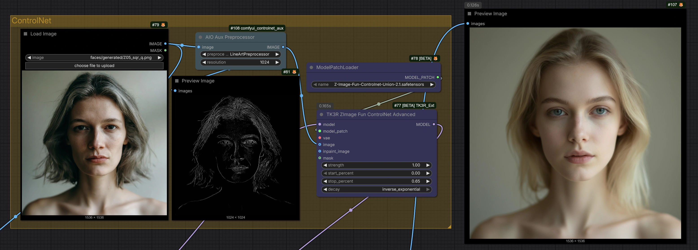


### TK3R Scheduled CFG Guider
Advanced version of the CFGGuider node allowing per-step CFG scheduling.

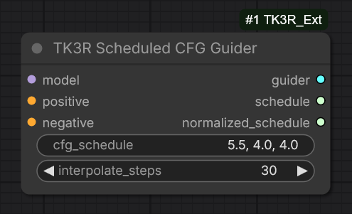

git push --force -u origin mainnotes: The schedule is comma separated floats interpolated over the set amount of steps, if you want something like an exponential curve just copy the same values several times; *schedule* output is the CFG schedule for info/debugging reasons, *normalized_schedule* is an output that can be used with a graph node to compare against the sigma schedule of models where the sigmas go 1.0 - 0.0


### TK3R TextEncodeQwenImageEditPlus Ext
An enhanced version of the TextEncodeQwenImageEditPlus node; not my code, but I do not remember where I got it from and it was an overwrite of the default node so I separated it into my nodes.

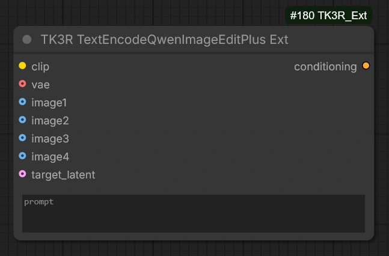


### TK3R CLIP Text Encode With Token Count
A version of the CLIP Text Encode node showing the character and token count after encoding. Useful for staying within the token count limits of the various encoders. It also merges the lumina2 text encode sysprompt code so there's no need to use a separate node.

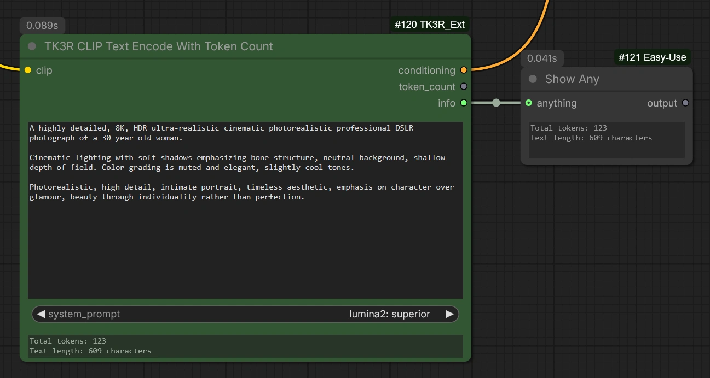


### TK3R Image Compare
This is a small utility node that caches the last input image. I use it together with rgthree Image Comparer to compare the current generation with the previous one. Simply wire the vae decode image output to its image input and output 1 will be the current image and output 2 - the previous one.

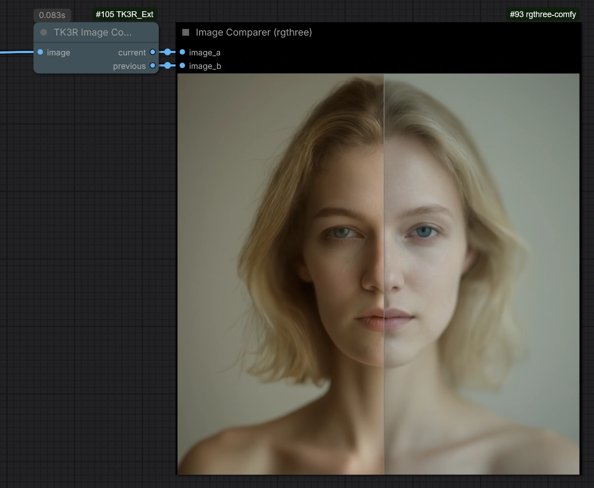


### TK3R Lora Rank Reader
A simple utility node that reads a lora and outputs its rank.

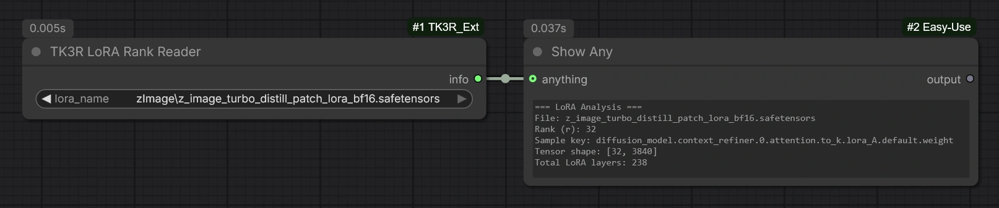


### TK3R Safetensors Precision Reader
A simple utility node that reads a safetensors file and outputs its floating-point precision.

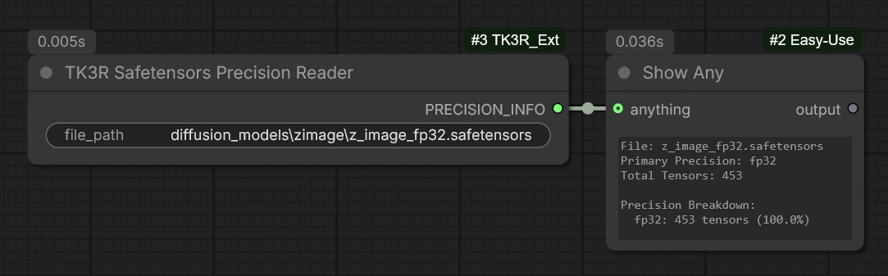


### TK3R Sigmas Interpolate
A simple utility node that allows blending two sigma schedules with the same step count. Just for fun.

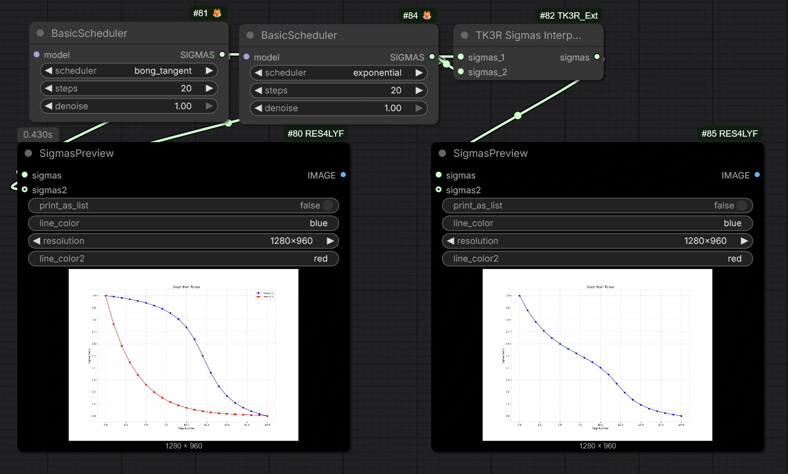


## License
GPLv3 License same as ComfyUI license as several nodes are derivatives of ComfyUI nodes - See LICENSE file for details


## Credits
- Node loader code adapted from [WAS Extras](https://github.com/WASasquatch/WAS_Extras), thank you [WAS](https://github.com/WASasquatch)
- These nodes are mostly vibe-coded with different Github Copilot agents


## Changelog

### v1.0.0
- Initial release
- TK3R ControlNet Apply Advanced
- TK3R Qwen Image Diffsynth ControlNet Advanced / TK3R ZImage Fun Controlnet
- TK3R Scheduled CFG Guider
- TK3R TextEncodeQwenImageEditPlus Ext
- TK3R CLIP Text Encode With Token Count
- TK3R Image Compare
- TK3r Lora Rank Reader
- TK3R Safetensors Precision Reader
- TK3R Sigmas Interpolate